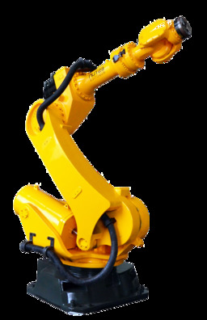
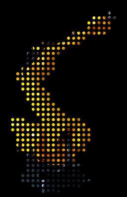
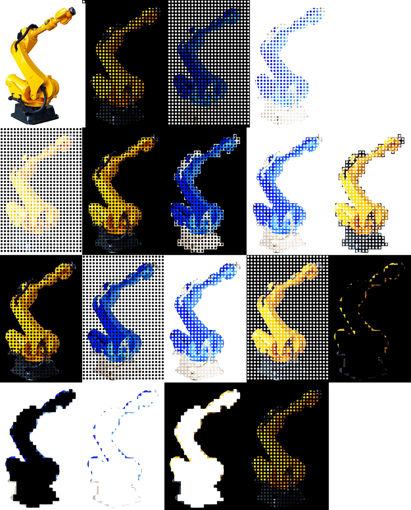

# Mask pattern filter

This procedural Python script filters input images with internal or provided mask images in a tile pattern according to specified parameters.

Masks can be not just binary, but also grayscale and RGB/colorful in the perceptual sense, leading to some interesting results.
## Showcase

### Example

| Input | Mask | Output |
|:-----:|:----:|:------:|
|  |  |  |

### Results



## Roadmap

Currently there is no further development planned.

However, should this change, a potential roadmap would look like this:

Version 1.0.1:

1. Rewrite the procedural routine into classes
2. Modularize depending on functionality
3. Refactor and optimize specific routines
4. Documentation via Doxygen

## Dependencies

* Python 2.7
  - OpenCV (`cv2`)
  - NumPy (`numpy`)
  - Matplotlib (`matplotlib`: `pyplot`, `rcParams`)
  - Argparse (`argparse`)

### Ubuntu/Debian

Due to current state of limitation to the already past EOL Python 2.7, the following is valid for Ubuntu 18.04 LTS only, which at time of writing is reaching its EOL as well.

```
# apt install python-{argcomplete,matplotlib,numpy,opencv}
```

## Download

Get the source code

```
$ git clone http://github.com/em-er-es/mask-pattern
```

For running the script on Docker use the overlay repository inside `mask-pattern`

```
$ git clone http://github.com/em-er-es/devops
```

## Running

```
$ python2 mask.py -i input.png -m mask.png -o output.png
$ python2 mask.py -i input.png -in 1 -so 4 -f 1 -o output.png
```

To generate all processing outcomes, run the included script:

```
$ bash mask.sh
```

## Installation

Installation is optional. Since neither build nor package capability have been developed, and the script is self contained, simply install it into a directory under your `$PATH` or equivalent.

To adhere to FHS, which you can read about in `$ man file-hierarchy`, use `~/.local/bin`.

```
$ printf ${PATH//:/'\n'} | grep local
/home/user/.local/bin
/usr/local/sbin
/usr/local/bin

$ install -m 750 mask.py "$HOME/.local/mask"
```

If your `$PATH` does not hold `~/.local/bin`, you can expand it in your `~/.profile`/`~/.bashrc` or equivalent via `export PATH="${HOME}/.local/bin:${PATH}"`. This will prioritize local user path over the system ones.

## Usage

```
Usage: mask.py [-h] [-bt BINARYTHRESHOLD <0-255><!1>] [-i FILENAMEINPUT]
               [-im INTERNALMASK] [-in INVERT] [-g GRAYSCALE] [-f FILTERING]
               [-m FILENAMEMASK] [-o FILENAMEOUTPUT]
               [-sc SEPARATEMASKCHANNELS] [-sm SCALEMASK]
               [-so OUTPUTSELECTOR <0-b4>] [-sf SCALEFIT]
               [-t THRESHOLD <-100-255><!-85>] [-si SHOWIMAGES <0-b4><!0>]
               [-s] [-sp <SAVEPATH><!/tmp>] [-v VERBOSE]

Perform basic image processing on input by using a mask to generate output.

optional arguments:
  -h, --help            show this help message and exit
  -bt BINARYTHRESHOLD <0-255><!1>, --binary-threshold BINARYTHRESHOLD <0-255><!1>
                        Threshold for binary filtering
  -i FILENAMEINPUT, --input FILENAMEINPUT
                        Input image
  -im INTERNALMASK, --internal-mask INTERNALMASK
                        Internal mask
  -in INVERT, --invert INVERT
                        Invert input, mask, output
  -g GRAYSCALE, --grayscale GRAYSCALE
                        Convert color space of input, mask, output
  -f FILTERING, --filter FILTERING
                        Use the mask as a filter
  -m FILENAMEMASK, --mask FILENAMEMASK
                        Mask image
  -o FILENAMEOUTPUT, --output FILENAMEOUTPUT
                        Output image
  -sc SEPARATEMASKCHANNELS, --separate-mask-channels SEPARATEMASKCHANNELS
                        Separate mask channels
  -sm SCALEMASK, --scale-mask SCALEMASK
                        Scale mask
  -so OUTPUTSELECTOR <0-b4>, --select-output OUTPUTSELECTOR <0-b4>
                        Select output: 0 -- Input; 1 -- !Output; 2 -- Output
                        mask; 3 -- Mask; 4 -- Filter; * -- Output without
                        scaling
  -sf SCALEFIT, --scale-to-fit SCALEFIT
                        Scale mask to fit
  -t THRESHOLD <-100-255><!-85>, --threshold THRESHOLD <-100-255><!-85>
                        Threshold for mask
  -si SHOWIMAGES <0-b4><!0>, --show-images SHOWIMAGES <0-b4><!0>
                        Show images
  -s, --save-images     Save images
  -sp <SAVEPATH><!/tmp>, --save-path <SAVEPATH><!/tmp>
                        Definitions path for generated images, implies save
                        images option
  -v VERBOSE, --verbose VERBOSE
                        Set verbose level
```
